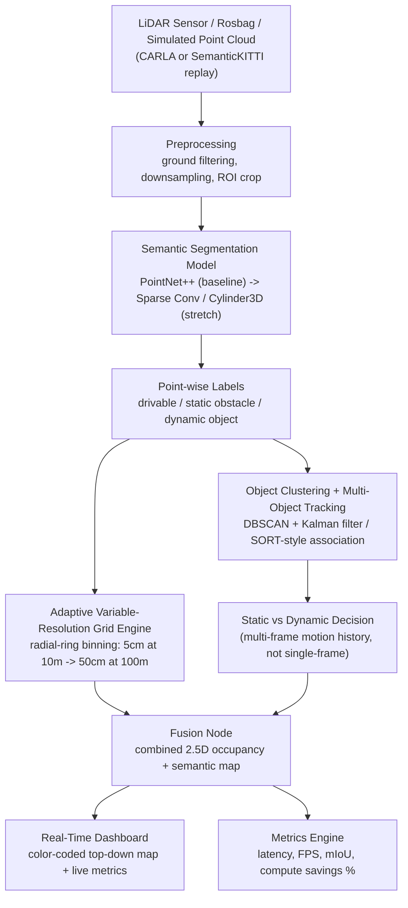

# RakshaSetu — Project Execution Plan

**Document type:** Binding execution plan (process, roles, schedule, and standards)
**Status:** ACTIVE — v1.1
**Effective from:** 2026-09-11 (last updated 2026-09-12 — see §10 Version history)
**Document owner:** p3iyanshu (Team Lead)
**Applies to:** all 6 members of Team JanSetu

> **This document is the single source of truth for scope, roles, schedule, and process.**
> Once issued, it is followed as written. If reality requires a change — a deadline slips, a role shifts, a tech choice changes — that change is made *to this document first* (see §10, Governance), not worked around informally in chat. This mirrors the same discipline the team already applies to `shared/schemas.py`: agree, document, then act — never the other way around.

Related documents (do not duplicate — read these for deeper technical detail):
- [`SIH2026_PS26053_Roadmap.md`](SIH2026_PS26053_Roadmap.md) — original problem-research and architecture notes
- [`team_tasks/00_interfaces_and_handoff.md`](team_tasks/00_interfaces_and_handoff.md) — the data contract and PR handoff process (still binding, referenced throughout §6)
- [`team_tasks/01_..06_*.md`](team_tasks/) — each member's full technical brief
- [`shared/schemas.py`](shared/schemas.py) — the interface contract in code

---

## 0. Immediate Priority — Read This First

Two dates govern everything else in this document:

| Date | Day | Event |
|---|---|---|
| **2026-09-12 (Saturday)** | **today** | **HARD DEADLINE — every member pushes their current work to GitHub** (`https://github.com/p3iyanshu/RakshaSetu`), on their own `feature/<module>` branch, with a PR opened even if the module isn't finished |
| **2026-09-16 (Wednesday)** | in 4 days | **Internal hackathon** |

As of this document's issue date, a repo audit shows the GitHub remote has **only the `main` branch with the initial commit** — none of the real module work done since (segmentation model, tracking module, dashboard scaffold) has been pushed. That work exists only on local machines. If a laptop dies, a file gets overwritten, or a branch gets checked out over untracked work between now and Saturday, that work is gone. See §7 for the full status audit and §8.1 for the exact per-day plan to close this gap.

**Action for every member, today:** commit what you have, on your own feature branch, and push it. Incomplete code on GitHub is recoverable and reviewable. Finished code still sitting on a laptop is not.

---

## 1. Executive Summary

RakshaSetu is Team JanSetu's submission for **SIH 2026, Problem Statement 26053** — an adaptive, variable-resolution 2.5D LiDAR mapping system for real-time perception on autonomous ground vehicles. The system segments a LiDAR point cloud into drivable terrain and obstacles, tracks obstacles across frames to separate static from dynamic ones, and represents the result as a **non-uniform grid whose cell size grows with distance from the vehicle** — fine detail up close, coarse detail far away — instead of the uniform-resolution grids most existing systems use.

The team is six members, each owning one pipeline stage, working against a shared interface contract (`shared/schemas.py`) so every module can be built and tested independently before the pieces are wired together. This document sets: the detailed problem understanding every member should be able to explain to a judge, what makes our solution different from the obvious/naive approaches, exactly what each member owns, how we work (git/CI/testing standards), and the timeline from today through the internal hackathon and beyond.

---

## 2. Problem Statement — Detailed Breakdown

### 2.1 Quick facts

| Field | Value |
|---|---|
| PS ID | 26053 |
| Title | Adaptive Variable-Resolution 2.5D LiDAR Mapping for Dynamic Environment Perception |
| Category | Software |
| Theme | Transportation & Logistics |
| Organization | DRDO / Department of Defence Production |
| Domain | Autonomous vehicle perception, point-cloud processing, real-time spatial computing |

*Caveat carried over from the original research doc: verify exact wording, evaluation criteria, and portal deadlines against the official SIH 2026 portal PDF before final submission — the text below is a compiled, directionally-correct understanding, not the verbatim legal problem text.*

### 2.2 The context, explained point by point

**2.2.1 — The computational bottleneck.** A spinning LiDAR sensor at 10–20 Hz produces hundreds of thousands to millions of 3D points per second. Processing every point at full, uniform resolution in real time is computationally expensive enough that it becomes the limiting factor for embedded, power-constrained hardware (the DRDO UGV use case) long before the perception algorithm itself runs out of accuracy headroom.

**2.2.2 — The core insight the PS is pushing teams toward: you don't need uniform resolution.** Objects close to the vehicle (within roughly 10 m) need fine detail — a curb, a small rock, a person's leg — because a small object nearby is a real hazard and there is little time to react. Objects far away (out to roughly 100 m) can be represented coarsely — the system mainly needs to know *something is there and roughly what class it is*, not its exact shape, because there is more time to react and the sensor itself is noisier and sparser at range. This is the same principle as foveated vision in biological eyes: high acuity at the center of gaze, low acuity in the periphery.

**2.2.3 — Why "2.5D" and not full 3D or flat 2D.** A full dense 3D voxel grid at fine resolution over a realistic sensing volume is computationally infeasible in real time (the exact math is in §4.3). A flat 2D top-down grid is cheap but throws away height, so it cannot distinguish a flat road from a curb, a pothole, or an overhang — all of which matter for safety. "2.5D" is the deliberate middle ground: a 2D grid (cost scales with area, not volume) where **each cell also carries a height/elevation/occupancy value**, so the safety-critical shape information survives without paying for a full 3D volume.

**2.2.4 — Why this matters beyond the hackathon.** For DRDO specifically: unmanned ground vehicles, convoy autonomy, and perimeter robots need real-time terrain and threat perception running on embedded, power-constrained hardware — this is not a "run it on a workstation GPU" problem. Civilian relevance (why the theme is Transportation & Logistics, not Defence): the same technique applies directly to autonomous logistics vehicles, warehouse AGVs/AMRs, last-mile delivery robots, and ADAS systems.

### 2.3 The three mandatory technical capabilities

The system must do three things — every one of these is a distinct, judge-visible capability, not an implementation detail:

1. **Terrain segmentation.** Classify every LiDAR point (or cell) as drivable or non-drivable: ground plane and clear path vs. curbs, ditches, walls, dense vegetation. This is the foundation everything else builds on.
2. **Obstacle detection and classification — static vs. dynamic.** Detect static obstacles (parked vehicles, poles, walls) and dynamic objects (pedestrians, moving vehicles, animals), and correctly tell the two apart. A downstream planner must treat a stationary wall completely differently from a person who might step into the vehicle's path — this split is not cosmetic, it's safety-critical.
3. **Adaptive spatial representation.** Build the map on a non-uniform grid — e.g., 5 cm cells within 10 m, coarsening to 50 cm cells at 100 m — instead of one fixed resolution everywhere. This is the specific, named novelty the problem statement is asking for; it is not optional or a "nice to have" on top of segmentation and tracking.

### 2.4 Mandated deliverables

- A **real-time visualization dashboard**: a color-coded map (green = drivable, red = static obstacle, yellow/blue = dynamic object, with a confidence gradient).
- **Performance metrics**, reported from real runs, not estimated: latency (ms/frame, FPS) and classification accuracy (mIoU, precision/recall) — these numbers are what prove the adaptive-resolution approach is both fast and accurate, not just fast, and not just accurate.

### 2.5 Evaluation lens (what judges are actually scoring)

Reading between the lines of §2.3–2.4, a credible submission is judged on: (a) does the adaptive-resolution mechanism actually exist and actually save compute/memory, benchmarked against a uniform grid, not just described; (b) is the static/dynamic split real and validated, not hand-waved; (c) do the reported latency/accuracy numbers hold up to scrutiny (internally consistent, reproducible); (d) is the system demonstrably viable on constrained hardware, matching the defence use case; (e) is the live demo real, with a fallback if it breaks. Every section below is built to satisfy one or more of these.

---

## 3. Our Solution — And How It Differs From the Obvious Approaches

### 3.1 Solution in one sentence

A pipeline that segments and tracks a LiDAR point cloud, then bins the result into a **sparse, radial-ring 2.5D grid whose cell size grows with distance from the vehicle** — every point maps to exactly one cell with no ambiguity — and streams the fused result to a live, judge-facing dashboard with real benchmarked metrics.

### 3.2 Architecture

### 3.3 What makes this different from the existing / naive approaches

| Existing / naive approach | Its limitation | RakshaSetu's approach | Why this is better |
|---|---|---|---|
| Full dense 3D voxel grid at fine resolution everywhere | ~1.6 billion voxels for a 200m x 200m x 5m volume at 5cm resolution — computationally infeasible in real time | Sparse hash map keyed by `(ring, angular_bin)`, populated only where points actually land | Memory and compute scale with occupied cells, not the full volume — and most of the far-field grid is empty or coarse by design |
| Flat 2D bird's-eye-view grid (common in simple AV costmaps) | Discards height entirely — cannot distinguish a flat road from a curb, pothole, or overhang | 2.5D cells carrying `height_max`, `height_mean`, class, and confidence, aggregated across every point that lands in the cell | Keeps the exact safety-relevant shape information a flat grid throws away, without paying for a full 3D volume |
| Uniform high-resolution grid everywhere (the "just make it fine everywhere" default) | Either too slow (fine everywhere) or blind at range (coarse everywhere) — a single resolution can't serve both requirements at once | Four fixed radial rings (0-10m/5cm, 10-30m/15cm, 30-60m/30cm, 60-100m/50cm), each point deterministically mapped to exactly one ring by its polar radius | Matches both the physics (LiDAR points get sparser with range) and the safety requirement (less reaction time up close) — and because the ring table is fixed, there are no alignment/ambiguity errors at ring boundaries, which the PS explicitly calls out as a risk |
| Per-frame obstacle detection with no tracking | Cannot tell a stationary wall from a person about to step into the path — every obstacle looks the same | DBSCAN clustering + Kalman filter/SORT-style tracking across frames, with a minimum-consistent-frames rule before committing to a static/dynamic label | A planner downstream gets a real static/dynamic signal, not a single noisy frame's guess; single-frame sensor noise can't flip the classification |
| Assuming access to physical LiDAR hardware (common failure point for hackathon prototypes) | Most teams don't have real LiDAR, so the prototype either doesn't get built or can't be verified independently | Trains/validates on **SemanticKITTI** (real recorded point clouds with ground truth), demos live on **CARLA** (scripted pedestrians/vehicles, so the "dynamic environment" requirement is guaranteed, not hoped for) | Fully reproducible and judge-verifiable without hardware dependency, and the same code path deploys to real sensor data later with no rewrite |
| Bolting security/optimization on at the end, if there's time | Usually there isn't time, and it shows — auth is missing, latency numbers are estimated not measured | Security (TLS/JWT/SROS2) and optimization (ONNX/TensorRT) are an explicit owned workstream (Member 6) from week 1, not a week-5 scramble | "Security-by-design," and every reported metric comes from an actual run — judges check this arithmetic |

### 3.4 The one-sentence pitch claim

*"A variable-resolution radial-ring 2.5D grid that maps every LiDAR point to exactly one cell with no ambiguity, giving a measured — not asserted — memory and compute saving over a uniform grid, while preserving the height information a flat 2D grid would lose."*

---

## 4. Technical Approach & Implementation Strategy

### 4.1 Build philosophy — contract-first, parallel from day one

Nobody waits on a teammate's real output. Every member builds and tests against `shared/schemas.py` (the interface contract) and `shared/mock_data.py` (a realistic fake LiDAR scene generator) from day one, and swaps in real upstream output only once it exists. This is already set up and working — it is the single most important process rule on this project, and it is why five of six modules already have real progress despite no integration having happened yet (see §7). **Protect this rule.** The moment someone changes a shape in `shared/schemas.py` without telling everyone downstream, the last week turns into firefighting instead of polish.

### 4.2 Pipeline, stage by stage

1. **Ingest** a LiDAR point cloud — from SemanticKITTI (training/validation) or a live CARLA feed (demo).
2. **Preprocess** — ground-plane noise handling, ROI crop, downsampling of over-dense near-field regions.
3. **Segment** — a deep learning model labels every point `drivable / static_obstacle_wall / static_obstacle_pole / dynamic_vehicle / dynamic_pedestrian / other_unknown` (six classes as of the v2 contract, §10 — static and dynamic each split into two, see `ros2_ws/interfaces.md`).
4. **Cluster + track** — group obstacle points into objects, track them frame-to-frame, decide static vs. dynamic from multi-frame motion history.
5. **Build the adaptive grid** — bin points into the radial-ring sparse grid (§3.3); this is the core novel deliverable.
6. **Fuse** — combine the grid (terrain/obstacle layer) with tracked objects (dynamic layer) into one 2.5D map.
7. **Visualize** — stream to a color-coded, real-time dashboard.
8. **Measure** — latency, FPS, mIoU, and compute-savings %, from real runs.

### 4.3 The bottleneck math (why adaptive resolution is necessary, not decorative)

A uniform 5 cm grid over a 200m x 200m area needs `(200/0.05)^2 ≈ 16` million cells for a flat 2D grid, and roughly **1.6 billion voxels** if done as a dense 3D volume with a 5 m height range at 5 cm resolution — infeasible to update at sensor frame rate. The four-ring adaptive scheme concentrates fine cells only where they earn their cost (near-field, safety-critical) and coarsens aggressively at range where sensor density is already falling off. Member 2 benchmarks the exact savings percentage against a uniform baseline — this is not asserted, it is measured and reported (§7, Member 2 deliverables).

### 4.4 Technology stack

| Layer | Technology | Why |
|---|---|---|
| Core language | Python (all modules) + C++ optional for the grid engine if pure-Python binning is too slow | Fast DL iteration in Python; drop to C++/Numba only if profiling shows a real bottleneck |
| Deep learning framework | PyTorch | Industry standard for point-cloud models |
| Segmentation model | PointNet++ (baseline, in progress) → Sparse Conv (`spconv`/MinkowskiEngine) or Cylinder3D if time allows | PS explicitly suggests PointNet++/Sparse Conv Nets |
| Point-cloud tooling | Open3D, NumPy | Ground-plane RANSAC fitting, downsampling |
| Clustering / tracking | scikit-learn (DBSCAN), SciPy (Hungarian algorithm), Kalman filter (hand-rolled or `filterpy`) | Standard, well-understood, fast enough for real time |
| Robotics middleware | ROS 2 (Humble) | Pub/sub, message sync, clean sensor/sim swap-in |
| Simulation | CARLA | Scripted pedestrians/vehicles — guarantees a genuinely dynamic scene for the demo, with free ground truth |
| Training/benchmark dataset | SemanticKITTI (primary), nuScenes-lidarseg (cross-check) | Pre-labeled real-world point clouds; standard train/val split (seq 00-07,09-10 / val on seq 08) keeps numbers comparable to published results |
| Inference acceleration | ONNX Runtime → TensorRT | Needed to back up the "real-time" claim with a measured number |
| Dashboard backend | FastAPI + WebSocket | Streams fused frames to the frontend in real time |
| Dashboard frontend | React + Tailwind + Three.js/deck.gl | Live color-coded 2.5D map with visibly varying cell sizes, plus a metrics panel |
| Security | TLS (`wss://`), JWT auth, SROS2 keystores for node-to-node traffic | Security-by-design, not bolted on |
| Version control | Git + GitHub (`p3iyanshu/RakshaSetu`) | Team collaboration, §6 |
| CI | GitHub Actions | Automated contract-test gate on every PR, §6.2 |
| Containerization (stretch) | Docker | Reproducible demo environment once the pipeline stabilizes |
| Edge target (stretch) | NVIDIA Jetson Orin/Xavier NX | Proves viability on power-constrained hardware, matching the DRDO UGV use case |

---

## 5. Team Structure & Role Assignments

### 5.1 Roster

| # | Role | Module | Folder | Branch | Name / GitHub handle |
|---|---|---|---|---|---|
| — | Team Lead / Coordinator | Owns this document, integration risk tracking, go/no-go call for the internal hackathon | — | — | p3iyanshu |
| 1 | Data & Segmentation Model Lead | Point-wise classification | `data/`, `models/` | `feature/segmentation-model` | *(fill in)* |
| 2 | Adaptive Grid Engine Lead | The core novel algorithm | `grid_engine/` | `feature/grid-engine` | *(fill in)* |
| 3 | Clustering & Tracking Lead | Static vs. dynamic object tracking | `tracking/` | `feature/tracking` | *(fill in)* |
| 4 | Systems Integration Lead | ROS 2 pipeline, CARLA bridge, fusion node, owns the contract | `ros2_ws/` | `feature/ros2-integration` | *(fill in)* |
| 5 | Dashboard & Visualization Lead | Live judge-facing demo UI | `dashboard/` | `feature/dashboard` | *(fill in)* |
| 6 | Security, Optimization, Testing & Pitch Lead | Cross-cutting hardening, benchmarking, pitch | `security/` | `feature/security-optimization` | *(fill in)* |

*Fill in names/handles and keep this table current — it is the roster judges and mentors may ask to see.*

### 5.2 Detailed responsibilities per member

**Member 1 — Data & Segmentation Model.** Owns the first link in the chain: turns raw LiDAR points into per-point labels (`drivable / static_obstacle_wall / static_obstacle_pole / dynamic_vehicle / dynamic_pedestrian / other_unknown`, plus a training-only `ignore` sentinel) with a confidence score. Responsibilities: acquire and register SemanticKITTI + nuScenes-mini + CARLA's semantic LiDAR blueprint; build the class-remapping layer collapsing each source's native taxonomy into the 6 shared classes; build the dataloader (standard seq 00-07,09-10 train / seq 08 val split); ship a trivial height-threshold placeholder classifier on day one so Members 2 and 3 are never blocked; train the real PointNet++ model and report per-class IoU and overall mIoU; later help export to ONNX/TensorRT with Member 6. **Contract delivered:** `classify(points[N,4]) -> labels[N], confidence[N]`. Full detail: [`team_tasks/01_data_and_segmentation_model.md`](team_tasks/01_data_and_segmentation_model.md).

**Member 2 — Adaptive Grid Engine.** Owns the single most important deliverable in the project — the specific novelty the problem statement asks for. Responsibilities: ground-plane fitting (RANSAC via Open3D) to get height-above-ground, not raw sensor-frame z; the radial lookup table (unambiguous point-to-cell mapping, indexed by ground-plane position — `range_bin`/`angular_bin`, per `ros2_ws/interfaces.md` v2, **not** LiDAR vertical channel); per-cell aggregation (point count, max/mean height, majority class, confidence) — not just the last point seen, or the "2.5D" claim is hollow; sparse hash-map storage; unit tests for boundary cases (band edges, angular wraparound, near/far clipping); and the benchmark that produces the adaptive-vs-uniform memory/compute savings percentage — the headline pitch number. Does **not** need to wait on Member 1's trained model — build against random mock-labeled points from day one. **Contract delivered:** sparse grid `dict[(range_bin, angular_bin)] -> {class, height_max, height_mean, point_count, confidence}` (string-keyed `"{range_bin}_{angular_bin}"` on the wire). Full detail: [`team_tasks/02_adaptive_grid_engine.md`](team_tasks/02_adaptive_grid_engine.md).

**Member 3 — Clustering & Tracking.** Turns Member 1's point-level labels into object-level tracks and decides static vs. dynamic. Responsibilities: DBSCAN clustering on obstacle-labeled points (tune `eps` per radial band, since point density falls off with range); per-cluster feature extraction (centroid, bounding box, dominant class); Kalman filter + Hungarian-algorithm (SciPy) frame-to-frame association with persistent track IDs; **ego-motion compensation** (per `ros2_ws/interfaces.md` v2 SS6) — consuming Member 4's `EgoOdometry` topic to separate an object's true world velocity from apparent motion caused by the ego vehicle's own movement; a static/dynamic decision derived from the *compensated* velocity over several consistent frames, not a single noisy one, and never from the raw/relative velocity; validation against SemanticKITTI's built-in `moving-X` vs. `X` ground truth. **Contract delivered:** list of `{track_id, cls, position, velocity, velocity_relative, is_dynamic, confidence}` per frame. Full detail: [`team_tasks/03_clustering_and_tracking.md`](team_tasks/03_clustering_and_tracking.md).

**Member 4 — Systems Integration (ROS 2 + CARLA).** Wires every other member's module into one running, timed pipeline, and owns the interface contract everyone else builds against — this is why their day-1/day-2 task (documenting the topic-level contract, `ros2_ws/interfaces.md`) had to happen before anyone else could safely build the ROS 2 wrapper layer (it has — v2 is committed, and `shared/schemas.py` mirrors it on the Python side). Responsibilities: ROS 2 workspace scaffolding (`ros2_ws/src/rakshasetu/` with one thin-wrapper node per module — never reimplement another member's logic inside a node); `carla-ros-bridge` integration so a scripted CARLA scenario streams into the same topics a real sensor would use; timing/synchronization via `message_filters` and correct QoS profiles; the **fusion node** — the one piece of logic that is genuinely theirs to write, merging the grid (terrain layer) with tracked objects (dynamic layer); coordinating the two live integration checkpoints (§8.2). **Contract delivered:** fused frame streamed over WebSocket to Member 5; the whole pipeline handed to Member 6 for hardening. Full detail: [`team_tasks/04_systems_integration_ros2.md`](team_tasks/04_systems_integration_ros2.md).

**Member 5 — Dashboard & Visualization.** Builds what judges actually watch during the live demo. Responsibilities: FastAPI + WebSocket backend streaming fused frames; a mock JSON frame generator built *first*, matching the agreed schema, so the entire frontend can be finished before the real pipeline exists; a Three.js/deck.gl top-down renderer that visibly shows cells getting larger toward the edges (not just a color change — the resolution difference is the actual point being demonstrated); tracked-object overlays with motion trails for dynamic objects; a live metrics panel (FPS, latency, mIoU, compute savings %) pulling real numbers off the WebSocket payload, never hardcoded; visual consistency with the pitch deck's color language; a late, close-to-one-line swap from the mock feed to Member 4's real feed once it exists. **Contract received:** WebSocket JSON stream of grid cells, objects, and metrics. Full detail: [`team_tasks/05_dashboard_visualization.md`](team_tasks/05_dashboard_visualization.md).

**Member 6 — Security, Optimization, Testing & Pitch.** Cross-cutting; floats to whichever module is the bottleneck early on (usually Member 1's training), then does the heavy lifting once the other pieces exist. Responsibilities: dashboard auth (TLS `wss://`, JWT, basic viewer/admin RBAC), SROS2 keystores for encrypted node-to-node ROS traffic, input validation (reject NaN/Inf points, Pydantic models on every endpoint), structured audit logging — framed honestly in the pitch as "security-by-design," not a defence-certification claim; ONNX/TensorRT export and re-benchmarking of Member 1's model, with a Jetson deployment test if hardware is available; full end-to-end integration testing on a scripted CARLA run; pulling together the final, internally-consistent metrics set everyone quotes in the pitch (mIoU, grid savings %, tracking accuracy, latency/FPS all cross-checked against each other); a pre-recorded fallback demo video; keeping the pitch deck synced to what's actually built, and rehearsing on the real prototype, not just slides. Full detail: [`team_tasks/06_security_optimization_testing_pitch.md`](team_tasks/06_security_optimization_testing_pitch.md).

### 5.3 The one rule that governs all six

Everyone can work in parallel starting day one **only** as long as they build against `shared/schemas.py` (using mock data where needed) instead of waiting for a teammate's real implementation, and nobody changes a shared shape without telling everyone downstream first, updating the contract file, and only then changing code. This is already written into [`team_tasks/00_interfaces_and_handoff.md`](team_tasks/00_interfaces_and_handoff.md) — this document elevates it from a module-level rule to a project-wide one (§10).

---

## 6. DevOps & Engineering Standards

### 6.1 Version control strategy

- `main` is protected: always-working code only, nobody commits directly to it.
- Each member works on their own `feature/<module>` branch (see the roster in §5.1 for exact names). Commit early and often there — there is no penalty for messy commits on a feature branch.
- Merges into `main` happen **only via Pull Request**, never a self-merge, and only after review approval (§6.3).
- Branches not yet created (`feature/grid-engine`, `feature/ros2-integration`, `feature/dashboard`, `feature/security-optimization`) must be created and pushed by their owner by **Saturday 2026-09-12** (§0, §7).

### 6.2 Continuous Integration

A GitHub Actions workflow (`.github/workflows/contract-tests.yml`, added alongside this document) now runs `pytest tests/test_contracts.py` automatically on every push and every pull request. This is the automated form of the rule already in `team_tasks/00_interfaces_and_handoff.md` §2: *prove your module matches the contract before anyone reviews the PR*. A red CI check is a hard blocker on merge — it means the module's output no longer matches `shared/schemas.py`, which is exactly the failure mode this whole process exists to catch early instead of during integration week.

### 6.3 Code review policy

- PR title format: `[ModuleName] short description`.
- PR description must state: what changed, which contract stage it implements, a sample input → output snippet or fixture link, and confirmation the contract test passes locally.
- Tag **Member 4** as reviewer on any PR that touches the pipeline/integration surface — they need visibility into every module that talks to their fusion node.
- For pure module-internal work, at least one other member reviews within 24 hours given the compressed timeline to the 16th — don't let a PR sit unreviewed over the weekend before the hackathon.
- Merge only after approval and a green CI check.

### 6.4 Environment & dependency management

- Each module folder that needs Python dependencies keeps its own `requirements.txt` (the pattern `dashboard/backend/requirements.txt` already follows — continue it for `grid_engine/`, `ros2_ws/`, and `security/` once those start).
- Datasets and trained checkpoints never enter git — `.gitignore` already excludes `data/semantickitti/`, `data/nuscenes/`, `data/carla/`, `models/checkpoints/`, `*.pth`, `*.onnx`. Keep extending this list rather than force-adding large files.
- Docker packaging is a stretch goal for pipeline reproducibility once the end-to-end system is stable (targeted alongside Phase 6 in §8.3) — not a blocker for the internal hackathon.

### 6.5 Testing strategy

- **Contract tests are mandatory before opening a PR** — `pytest tests/test_contracts.py -v` must pass locally, and will now also be enforced by CI (§6.2).
- **Module-level unit tests** for the edge cases each brief calls out explicitly — e.g., Member 2's ring-boundary and angular-wraparound cases, Member 3's multi-frame static/dynamic decision logic. These live alongside each module (see `tracking/tests/` as the existing pattern) and are the individual member's responsibility, not Member 6's.
- **Integration tests** (full pipeline on a scripted CARLA scenario) are Member 6's responsibility once the pieces exist (§5.2).

### 6.6 Security hygiene (applies now, not just to Member 6's workstream)

- Never commit API keys, tokens, or credentials. Never commit raw datasets (§6.4).
- TLS + JWT on the dashboard, and SROS2 keystores for ROS 2 traffic, are tracked as explicit Member 6 deliverables from early in the timeline (§8.3), not a last-week addition.
- Present all security work honestly as "security-by-design" for a hackathon prototype — never claim defence-grade certification, which is a real, months-long process outside this project's scope.

### 6.7 Documentation standards

Every module folder keeps its own `README.md` explaining what it does and how to run it — `shared/`, `data/`, `models/`, `tracking/`, `dashboard/` already follow this. `grid_engine/`, `ros2_ws/`, and `security/` must follow the same pattern from their first commit, not retrofitted later.

### 6.8 Demo-day reproducibility

Once the pipeline is stable enough for a rehearsal (target: 2026-09-15, §8.1), tag the exact commit used for the internal hackathon demo (`git tag v0-internal-hackathon`) so the demo state is pinned and reproducible, separate from whatever work continues afterward. Member 6's pre-recorded fallback video (§5.2) remains mandatory regardless of how confident the live demo looks.

---

## 7. Current Status Snapshot (as of 2026-09-11)

This is a factual audit of the repository and branches as they exist today, not a self-report — it is what determines the urgency in §0 and the day-by-day plan in §8.1.

| Module | Local progress | On GitHub? | Risk level | Immediate action |
|---|---|---|---|---|
| Member 1 — Segmentation | Substantial: data pipeline, class remapping, PointNet++ model, a critical kNN-to-ball-query bug fix, downsample-then-propagate inference, real training run (mIoU reported). One deliberate, documented deviation from the approved architecture on 2026-09-14 to hit that day's demo deadline: `farthest_point_sample` swapped for random sampling (~11x faster per step) — see version history v1.2 and commit `b562fdc`. Commits on `feature/segmentation-model`. | **No** — branch not pushed, no PR open | Low (work exists, just not shared) | Push `feature/segmentation-model`, open a PR by Saturday |
| Member 2 — Grid Engine | `grid_engine/` folder does not exist yet in the working tree — no visible work | **No** | **High** — this is the core novel deliverable the PS is graded on | Start immediately; even a mock-data-driven skeleton (ground-plane fit + radial lookup table) by Saturday is the priority over polish elsewhere |
| Member 3 — Tracking | Substantial: Kalman tracker, ego-motion handling, SemanticKITTI label validation, tests. But currently sitting **uncommitted, on the wrong branch** (`feature/segmentation-model` instead of `feature/tracking`) | **No** | **Medium-high** — real work exists but is at risk of being lost or committed onto the wrong branch | Move this work onto `feature/tracking`, commit, push, open a PR — see the git-hygiene note below |
| Member 4 — ROS 2 Integration | `ros2_ws/interfaces.md` v2 now committed (the topic-level contract — corrects the grid key, adds `EgoOdometry`, real Fusion reconciliation; see the v2 migration note below). Actual ROS 2 node code (`ros2_ws/src/...`) still does not exist | **Partial** — `interfaces.md` only | **High** — node scaffolding still blocks integration | Scaffold `ros2_ws/src/` and push `feature/ros2-integration` by Saturday, even as stubs |
| Member 5 — Dashboard | Substantial: FastAPI backend (`main.py`, mock generator, real-feed hook) and a React/Vite/Tailwind frontend scaffold, all present locally | **No** — no `feature/dashboard` branch created yet | Medium (work exists, just not shared) | Create `feature/dashboard`, commit, push, open a PR by Saturday |
| Member 6 — Security/Optimization/Testing/Pitch | `security/` does not exist yet | **No** | Low for now (this member's brief correctly has them floating/helping in weeks 1-2) | Start the security architecture doc now, and help unblock Members 2 and 4, who are furthest behind |

**Git hygiene note (Member 3's work):** the tracking module's files are currently untracked and sitting in the working tree while the active branch is `feature/segmentation-model`, not `feature/tracking`. Multiple team members share this one working directory across sessions (see project note on concurrent sessions), so a branch switch by anyone else can silently leave uncommitted work stranded or, worse, get it committed onto the wrong person's branch. **Fix this first, before anything else in this table:** switch to (or create) `feature/tracking`, commit the tracking files there, and push. Do not commit them while `feature/segmentation-model` is checked out.

**v2 contract migration note (2026-09-12):** Member 4 issued `ros2_ws/interfaces.md` v2, which changed the class scheme from 3 classes to 6 (`static_obstacle` split into `wall`/`pole`, `dynamic_object` split into `vehicle`/`pedestrian`), corrected the grid key from `(ring, angular_bin)` to `(range_bin, angular_bin)`, and added `EgoOdometry`-based velocity compensation to Tracking. `shared/schemas.py`, `data/class_mapping.py`, `models/placeholder.py`, `tests/test_contracts.py`, and every file in `tracking/` and `dashboard/` were migrated to match and re-verified (`pytest tests/test_contracts.py tracking/tests/` passing). One real, unavoidable side effect: **the existing trained checkpoint (`models/checkpoints/best.pth`) has a 3-class output head and is now incompatible** — it needs retraining under the 6-class scheme before `models/pointnet2.classify()` or `dashboard/backend/build_demo_data.py` can run again. `dashboard/backend/data/demo_sequence.json` (the precomputed real-data demo feed) was generated before this migration and still carries old-scheme class values — it will still load and play back without crashing, but tracked objects and grid cells that were genuinely `dynamic_object` will display with the new `static_obstacle_pole` color until it's regenerated against a retrained checkpoint. Several raw-class-to-simplified-class judgment calls in `data/class_mapping.py` (e.g., is a bicyclist a pedestrian or a vehicle?) are marked `# REVIEW:` inline and are a first pass, not team-confirmed.

**Bottom line:** two of six modules (grid engine, ROS 2 integration) have not been started, and they are on the critical path — nothing downstream of the grid engine or the fusion node can integrate without them. This is the team's real risk going into the 16th, not polish on the modules that already have progress.

---

## 8. Project Timeline

### 8.1 Critical path — today through the internal hackathon

| Date | Day | Focus |
|---|---|---|
| **2026-09-11** | Fri (today) | This execution plan issued and shared with the team. Every member reads their §5.2 section and §7 status. Anyone with local work commits it **on their own correct branch** today. |
| **2026-09-12** | **Sat — HARD DEADLINE** | **All 6 members' work pushed to GitHub**, each on their own `feature/<module>` branch, PR opened even if not mergeable yet. Team Lead reviews what landed against §7 and flags gaps same day. |
| **2026-09-13** | Sun | Catch-up day for whoever is behind — priority on Member 2 (grid engine) and Member 4 (ROS 2 scaffold), since both are currently unstarted and block everyone downstream. Members 1, 3, 5 (already ahead) begin pairwise integration support where possible. |
| **2026-09-14** | Mon | Integration pass: real segmentation output into the grid engine and tracker where ready; dashboard swaps its mock feed for whatever real/partial feed exists. |
| **2026-09-15** | Tue | Full rehearsal. Final metrics collected from real runs (§6.8, tag the demo commit). Fallback demo video recorded. Pitch deck synced to what's actually built. |
| **2026-09-16** | **Wed — Internal Hackathon** | Present. |

### 8.2 Integration checkpoints (do these live, not async)

At the two checkpoints below, get on a call or sit together and run the pipeline as a group rather than debugging mismatches separately over chat — a live fix with both people who wrote each side takes minutes; the same mismatch discovered independently, days apart, takes hours.

- **Weekend of 2026-09-13** (pairwise): Member 1's real model into Member 2's grid engine; Member 3's tracker into Member 4's ROS 2 graph.
- **2026-09-14 to 15** (full): the whole pipeline, live CARLA feed through to Member 5's dashboard.

### 8.3 Broader roadmap (beyond the internal hackathon)

The internal hackathon on the 16th is a checkpoint, not the finish line — the team still has the SIH idea-submission stage and, if shortlisted, a full prototype to build toward the Grand Finale. Condensed from the phase plan in [`SIH2026_PS26053_Roadmap.md`](SIH2026_PS26053_Roadmap.md) §7 (read that document for the full narrative):

| Phase | Focus | Key deliverable |
|---|---|---|
| Phase 1 — Data & baseline | SemanticKITTI/nuScenes loaders, baseline segmentation model | Trained model with reported mIoU |
| Phase 2 — Adaptive grid engine | Variable-resolution binning, benchmarked against a uniform grid | Grid engine + savings % (the headline result) |
| Phase 3 — Tracking & static/dynamic split | Clustering + Kalman tracking | Static/dynamic classification demo |
| Phase 4 — Fusion & real-time pipeline | Segmentation → grid → tracking wired into one ROS 2 pipeline with a live CARLA feed | End-to-end pipeline running near real time |
| Phase 5 — Dashboard | Color-coded live visualization with a metrics panel | Judge-facing live demo UI |
| Phase 6 — Optimization | TensorRT/ONNX conversion, profiling, optional Jetson test | Latency comfortably under the sensor frame period (target: under 100 ms/frame) |
| Phase 7 — Polish & pitch prep | Demo video, final metrics table, rehearsed live demo with fallback | Grand Finale-ready package |

Exact SIH portal submission deadlines should be re-verified against the official portal before that stage — see the caveat in §2.1.

---

## 9. Risks & Mitigations

| Risk | Mitigation |
|---|---|
| Grid engine and ROS 2 integration modules unstarted, both on the critical path | Explicit Saturday deadline (§0, §8.1) with named owners; Member 6 floats to help unblock these first, per their own brief |
| Team's only shared working directory means a branch switch by one member can strand another's uncommitted work (already happened once with the tracking module, §7) | Commit and push early and often, on the *correct* branch; check `git branch --show-current` before any commit; consider per-member worktrees if this recurs |
| No physical LiDAR hardware | CARLA simulation + SemanticKITTI/nuScenes — a fully viable, judge-expected path (§4.4) |
| Segmentation model too slow for a credible "real-time" claim | Lightweight architecture first (PointNet++ before Sparse Conv), ONNX/TensorRT export, honest reported FPS/latency from real runs |
| Adaptive grid engine complexity discovered late | It is explicitly the first priority for Member 2 starting now (§7), not something deferred to the last week |
| Live demo breaks during judging | Mandatory pre-recorded fallback video (§6.8, §5.2 Member 6) |
| Reported metrics don't hold up to scrutiny (e.g., FPS and latency don't match arithmetically) | Member 6 collects and cross-checks every final number from real runs before the pitch (§5.2) |

---

## 10. Governance — Change Control

This document is binding from 2026-09-11 onward. It is the reference used to settle any disagreement about scope, ownership, deadlines, or process between now and the internal hackathon (and beyond, until superseded).

**If something needs to change** — a deadline slips, a module's scope shifts, a tech choice changes, an owner changes:

1. Raise it in the team chat with the reason.
2. Get explicit agreement from every affected member and the Team Lead.
3. Update this document — bump the version, add a dated entry to the changelog below.
4. Only then act on the change in code or planning.

Do not silently work around this document. A plan that quietly stops being followed is worse than no plan — treat a needed deviation as a signal to update the document, not to ignore it.

### Version history

| Version | Date | Change |
|---|---|---|
| 1.0 | 2026-09-11 | Initial issue: full problem breakdown, solution differentiation, team assignments, DevOps standards, and timeline through the 2026-09-16 internal hackathon. |
| 1.1 | 2026-09-12 | Updated for Member 4's `ros2_ws/interfaces.md` v2 (6-class scheme, corrected grid key, `EgoOdometry`/velocity compensation) — see the v2 migration note in §7 and the updated contract references throughout §5.2. Refreshed §0's "tomorrow" language now that 2026-09-12 has arrived. |
| 1.2 | 2026-09-14 | Recording a same-day deadline deviation on Member 1's module (commit `b562fdc`): `models/pointnet2_utils.py`'s `farthest_point_sample` was swapped from genuine iterative farthest-point sampling to random sampling, to make training feasible before that day's demo. Measured cost: true FPS's `npoint`-iteration Python loop was the dominant per-step cost (367ms of SA1's ~520ms/step alone), an ~11x difference against random sampling of the same count. Ball query (unchanged) still defines every neighborhood by a fixed physical radius, so density-robustness is unaffected; what's compromised is how evenly the sampled centers themselves are spread across the scene versus true FPS — a real but secondary quality cost, flagged in the function's own docstring as a time-boxed trade-off to revisit (real FPS, or a proper CUDA implementation) once past the deadline, not a permanent architecture decision. |

---

## 11. Definition of Done — Internal Hackathon (2026-09-16)

- [ ] All 6 feature branches exist on GitHub and are pushed (not just local)
- [ ] Every branch has at least one PR open against `main`, even if not yet mergeable
- [ ] CI contract-test check is green on every open PR (§6.2)
- [ ] Grid engine has a working range-bin implementation and a reported adaptive-vs-uniform savings number, even on mock data
- [ ] Tracking module correctly committed on `feature/tracking` (not stranded on another branch)
- [ ] ROS 2 workspace exists with at least stub nodes for each stage
- [ ] Dashboard renders a live (even if mock-fed) color-coded grid with visibly varying cell sizes
- [ ] At least one reported metric set (mIoU, latency/FPS, compute savings %) is internally consistent and comes from a real run, not a placeholder
- [ ] A fallback demo recording exists
- [ ] The team has rehearsed the pitch against whatever is actually built, not just the slides

---

## 12. Appendix — Related Documents

- [`README.md`](README.md) — repo entry point and onboarding order
- [`SIH2026_PS26053_Roadmap.md`](SIH2026_PS26053_Roadmap.md) — original problem research and extended architecture notes
- [`team_tasks/00_interfaces_and_handoff.md`](team_tasks/00_interfaces_and_handoff.md) — the data contract and PR handoff process
- [`team_tasks/01_data_and_segmentation_model.md`](team_tasks/01_data_and_segmentation_model.md) through [`06_security_optimization_testing_pitch.md`](team_tasks/06_security_optimization_testing_pitch.md) — full per-member technical briefs
- [`ros2_ws/interfaces.md`](ros2_ws/interfaces.md) — Member 4's topic-level pipeline contract (v2) — the authoritative source `shared/schemas.py` mirrors
- [`shared/schemas.py`](shared/schemas.py) — the interface contract in code
- [`shared/mock_data.py`](shared/mock_data.py) — the shared mock LiDAR scene generator
- [`.github/workflows/contract-tests.yml`](.github/workflows/contract-tests.yml) — the CI gate added alongside this document (§6.2)
