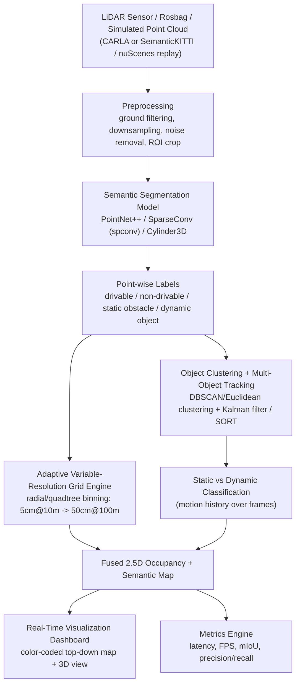

# SIH 2026 — Problem Statement 26053
## Adaptive Variable-Resolution 2.5D LiDAR Mapping for Dynamic Environment Perception

> **Source note:** The problem text below was compiled from the community-maintained SIH 2026 problem-statement archive (GitHub: `vedantchalke36/sih-2026-problem-statements`), since the official `sih.gov.in` portal is not directly indexable. Before final submission, **cross-check the exact wording, evaluation criteria, and deadline against the official SIH 2026 portal PDF** — treat the summary here as directionally correct, not a verbatim legal text.

---

## 1. Quick Facts

| Field | Value |
|---|---|
| **PS ID** | 26053 |
| **Title** | Adaptive Variable-Resolution 2.5D LiDAR Mapping for Dynamic Environment Perception |
| **Category** | Software |
| **Theme** | Transportation & Logistics |
| **Organization** | DRDO / Department of Defence Production |
| **Submission deadline (idea stage, as scraped)** | September 20, 2026 — **verify on official portal** |
| **Domain** | Autonomous vehicle perception, point-cloud processing, real-time spatial computing |

---

## 2. Problem Context

Autonomous ground vehicles (military UGVs, autonomous logistics vehicles, self-driving platforms) rely on **3D LiDAR** to perceive their surroundings. A LiDAR sensor spinning at 10–20 Hz can generate **hundreds of thousands to millions of 3D points per second**. Processing all of this at full, uniform resolution in real time is computationally very expensive — this is the "immense computational bottleneck" the problem statement calls out.

The core insight the problem is pushing teams toward: **you don't need the same resolution everywhere**.

- Objects **close to the vehicle** (within ~10 m) need **fine detail** — a curb, a small rock, a person's leg — because a small object nearby is a real hazard and there's little reaction time.
- Objects **far away** (up to ~100 m) can be represented **coarsely** — you mainly need to know "there is something out there and roughly what it is," not its exact shape, because there's more time to react and more sensor noise at range anyway.

This is exactly how human/animal vision and many real perception stacks behave (foveated vision) — and it's the "2.5D" trick: instead of a full dense 3D voxel grid (expensive), use a **ground-plane grid (like a top-down/bird's-eye-view map) where each cell also carries height/occupancy/class info**, and where **cell size itself varies with distance from the sensor**.

### Why it matters (real-world relevance)
- **Defence (DRDO angle):** unmanned ground vehicles, convoy autonomy, perimeter robots need real-time terrain + threat perception on embedded, power-constrained hardware.
- **Civilian spillover:** the same technique is directly usable in autonomous logistics vehicles, warehouse AGVs/AMRs, last-mile delivery robots, and ADAS — which is why the theme is "Transportation & Logistics."

---

## 3. Problem Breakdown — What Must Be Built

The system must do three things:

1. **Terrain segmentation** — classify LiDAR points/cells as **drivable** vs **non-drivable** (ground plane, slope, obstacle-free path vs curbs, ditches, walls, vegetation).
2. **Obstacle detection & classification** — detect **static obstacles** (parked vehicles, poles, walls) and **dynamic objects** (pedestrians, moving vehicles, animals), and tell the two apart.
3. **Adaptive spatial representation** — build the map using a **non-uniform grid**: e.g., **5 cm cells within 10 m**, coarsening out to **50 cm cells at 100 m**, instead of one fixed resolution everywhere.

Plus, as deliverables:
- A **real-time visualization dashboard** with color-coded map (e.g., green = drivable, red = static obstacle, yellow/blue = dynamic object, gradient by class confidence).
- **Performance metrics**: latency (ms/frame, FPS) and classification accuracy (mIoU, precision/recall) to *prove* the adaptive-resolution approach is both fast and accurate.

---

## 4. Our Proposed Solution — Architecture

### Pipeline in plain language
1. **Ingest** a LiDAR point cloud (from a real sensor if available, otherwise from a public dataset or a simulator — see §6).
2. **Preprocess**: remove ground-plane noise where needed, downsample far-range sparse regions, crop to region of interest.
3. **Segment**: run a deep learning model that labels every point as drivable / non-drivable / obstacle / dynamic-candidate.
4. **Track**: cluster obstacle points into objects, track them frame-to-frame (Kalman filter / simple SORT) — an object that moves across frames is "dynamic," one that doesn't is "static."
5. **Build the adaptive grid**: instead of a uniform voxel/occupancy grid, bin points into a grid whose **cell size grows with distance from the vehicle** (fine near, coarse far) — this is the core novelty the PS is asking for, and it's what gives the real-time speedup.
6. **Fuse** segmentation + tracking + grid into one 2.5D map (x, y, plus height/occupancy/class per cell).
7. **Visualize** in real time with a color-coded dashboard.
8. **Measure** latency and accuracy to prove the approach works.

---

## 5. Technology Stack

| Layer | Technology | Why |
|---|---|---|
| **Core language** | Python (prototyping/ML) + C++ (perf-critical grid engine, optional) | Python for fast DL iteration; C++ if we need to hit hard real-time latency targets |
| **Deep learning framework** | PyTorch | Industry standard, best ecosystem for point-cloud models |
| **Point-cloud segmentation model** | PointNet++, or Sparse Convolution (via `spconv` / `MinkowskiEngine`), or Cylinder3D | PS explicitly suggests PointNet++/Sparse Conv Nets; Cylinder3D is a strong modern alternative built around cylindrical (range-based) partitioning — a natural fit for "variable resolution by distance" |
| **Point-cloud processing/IO** | Open3D, PCL (Point Cloud Library), NumPy | Ground filtering (RANSAC plane fit), downsampling, visualization prototyping |
| **Robotics middleware** | ROS 2 (Humble/Jazzy) | Standard for real-time sensor pipelines; gives us pub/sub, message sync, and easy sensor/sim swap-in |
| **Simulation (if no physical LiDAR)** | CARLA simulator | Generates realistic synthetic LiDAR + ground-truth labels for a driving scene — critical since most teams won't have real LiDAR hardware |
| **Public datasets (training/benchmarking)** | SemanticKITTI, nuScenes-lidarseg | Pre-labeled real-world point clouds with drivable/obstacle/dynamic-class annotations — used to train & benchmark the segmentation model without needing our own labeled data |
| **Adaptive grid engine** | Custom Python/C++ module (radial or quadtree-based binning); optionally OctoMap as reference | This is the differentiating piece of the project — not something you get off-the-shelf |
| **Multi-object tracking** | Kalman filter + simple SORT/DeepSORT-style association | Distinguishes static vs dynamic obstacles across frames |
| **Inference acceleration** | NVIDIA TensorRT / ONNX Runtime | Needed to hit real-time latency for the demo |
| **Visualization dashboard** | Three.js / deck.gl (web) or Foxglove Studio / RViz2 (ROS-native) | Real-time color-coded 2.5D map; deck.gl/Three.js gives us a slick browser demo for judges |
| **Dashboard backend** | FastAPI + WebSocket | Streams grid/segmentation output to the frontend in real time |
| **Frontend** | React + Tailwind | Fast to build a clean demo UI with live metrics (latency, FPS, accuracy) alongside the map |
| **Edge deployment target (stretch goal)** | NVIDIA Jetson Orin/Xavier NX | Shows the solution is viable on embedded/power-constrained hardware, matching DRDO's UGV use case |
| **Containerization** | Docker | Reproducible demo environment for judges/mentors |
| **Version control** | Git + GitHub | Team collaboration |

---

## 6. Getting LiDAR Data Without Hardware

Most teams won't have a physical LiDAR unit. Two solid options:
- **CARLA simulator**: spawn a vehicle with a simulated LiDAR sensor in a dynamic scene (pedestrians, other cars) — gives point clouds *and* ground truth for free, ideal for the "dynamic environment" requirement.
- **SemanticKITTI / nuScenes**: real-world recorded point clouds with per-point semantic labels — good for training/validating the segmentation model and reporting accuracy numbers.

Recommendation: **train/validate on SemanticKITTI**, **demo live on CARLA** (since CARLA can simulate moving pedestrians/vehicles on demand, which is harder to guarantee in a fixed recorded dataset).

---

## 7. Roadmap

Two tracks run in parallel: **(A) Idea/PPT submission track** (near-term, tight deadline) and **(B) Working prototype track** (build toward the Grand Finale, if selected — exact SIH 2026 finale date should be confirmed on the official portal).

### Track A — Idea Submission (now → ~Sept 20, 2026)

| Week | Focus | Output |
|---|---|---|
| **Week 1** (Aug 25 – Aug 31) | Literature review: PointNet++, SparseConv, Cylinder3D, foveated/adaptive LiDAR grids; finalize team roles | Shortlist of 2–3 candidate architectures; problem understanding doc |
| **Week 2** (Sep 1 – Sep 7) | Design the adaptive-resolution grid algorithm on paper; sketch system architecture; set up CARLA + SemanticKITTI environments | Architecture diagram, tech stack finalized, dev environment ready |
| **Week 3** (Sep 8 – Sep 14) | Build a minimal proof-of-concept: run a pretrained segmentation model on a sample point cloud, hand-build a quick variable-resolution grid visualization | Working PoC script + screenshots/video snippet |
| **Week 4** (Sep 15 – Sep 20) | Build the PPT: problem understanding, proposed solution, architecture diagram, tech stack, feasibility, impact; rehearse pitch | **Final PPT submitted on SIH portal** |

### Track B — Prototype Build (if shortlisted, ahead of Grand Finale)

| Phase | Focus | Key deliverable |
|---|---|---|
| **Phase 1 — Data & baseline** | Set up SemanticKITTI/nuScenes loaders; train/fine-tune a baseline PointNet++ or SparseConv segmentation model | Baseline model with reported mIoU |
| **Phase 2 — Adaptive grid engine** | Implement the core variable-resolution binning (5 cm near-field → 50 cm far-field); benchmark against a naive uniform grid | Grid engine + latency comparison chart (this is the headline result) |
| **Phase 3 — Tracking & static/dynamic split** | Add clustering + Kalman-filter tracking to separate static obstacles from moving objects across frames | Static/dynamic classification demo |
| **Phase 4 — Fusion & real-time pipeline** | Wire segmentation → grid → tracking into one ROS 2 pipeline; integrate CARLA as a live feed | End-to-end pipeline running in near real time |
| **Phase 5 — Dashboard** | Build the color-coded live visualization (deck.gl/Three.js) with a metrics panel (FPS, latency, accuracy) | Judge-facing live demo UI |
| **Phase 6 — Optimization** | TensorRT/ONNX conversion, profiling, possibly a Jetson deployment test | Latency numbers that hit "real-time" (target: comfortably under sensor frame period, e.g. <100 ms/frame) |
| **Phase 7 — Polish & pitch prep** | Demo video, final metrics table, slide deck, rehearsed live demo with fallback recording | Grand Finale-ready package |

---

## 8. Suggested Team Role Split (6-member SIH team)

| Role | Responsibility |
|---|---|
| **ML/Perception Lead** | Segmentation model (PointNet++/SparseConv/Cylinder3D), training, accuracy metrics |
| **Spatial/Algorithms Engineer** | Adaptive variable-resolution grid engine — the core novel algorithm |
| **Tracking Engineer** | Clustering + Kalman/SORT tracking for static vs dynamic classification |
| **Systems/Robotics Engineer** | ROS 2 pipeline, CARLA integration, sensor data flow, real-time performance |
| **Full-stack/Visualization Engineer** | Dashboard (FastAPI backend + React/Three.js/deck.gl frontend), metrics panel |
| **PM / Presentation Lead** | Problem research, PPT, pitch narrative, demo script, coordination with mentor |

*(Roles can overlap — most SIH teams have people covering 1.5–2 roles each.)*

---

## 9. Risks & Mitigations

| Risk | Mitigation |
|---|---|
| No access to real LiDAR hardware | Use CARLA simulation + public datasets (SemanticKITTI/nuScenes) — fully viable path, judges expect this |
| Segmentation model too slow for "real-time" claim | Use a lightweight architecture (SparseConv over dense 3D CNN), TensorRT/ONNX export, and clearly report FPS/latency honestly |
| Adaptive grid adds complexity/bugs late in timeline | Build and benchmark the grid engine **early** (Phase 2) since it's the differentiating requirement — don't leave it for last |
| Dashboard/demo breaks live during judging | Always have a **pre-recorded fallback video** of a full run |
| Team time crunch before Sept 20 idea deadline | Track A above is scoped to a PoC + PPT, not a full system — don't over-build before knowing you're shortlisted |

---

## 10. Success Metrics to Report

- **Latency**: ms per frame / FPS achieved end-to-end (segmentation + grid + tracking)
- **Accuracy**: mIoU or per-class IoU for drivable/non-drivable/obstacle segmentation (benchmarked on SemanticKITTI validation split)
- **Compression/efficiency gain**: % reduction in grid cells / memory vs. a naive uniform high-resolution grid — this is the number that proves the "adaptive" idea actually saves compute
- **Tracking quality**: qualitative (dashboard shows dynamic objects trailed/highlighted differently from static ones) or basic MOTA-style metric if time allows

---

## 11. Key References & Resources

- **Datasets**: [SemanticKITTI](http://www.semantic-kitti.org/), [nuScenes-lidarseg](https://www.nuscenes.org/)
- **Simulator**: [CARLA](https://carla.org/)
- **Models**: PointNet++ (Qi et al.), Sparse Convolution (`spconv`, `MinkowskiEngine`), Cylinder3D (Zhu et al.)
- **Point cloud tooling**: [Open3D](http://www.open3d.org/), [PCL](https://pointclouds.org/)
- **Robotics middleware**: [ROS 2](https://docs.ros.org/)
- **Visualization**: [deck.gl](https://deck.gl/), [Three.js](https://threejs.org/), [Foxglove Studio](https://foxglove.dev/)

---

## 12. Next Steps

1. Confirm the exact official problem statement text and deadlines on the **official SIH 2026 portal** (`sih.gov.in`) — the wording/deadline above came from a community archive.
2. Finalize team roles (§8).
3. Kick off Week 1 of Track A: literature review + environment setup (CARLA, SemanticKITTI, PyTorch, Open3D).
4. Build the PoC segmentation + grid visualization by end of Week 3.
5. Draft and rehearse the PPT for Week 4 submission.
